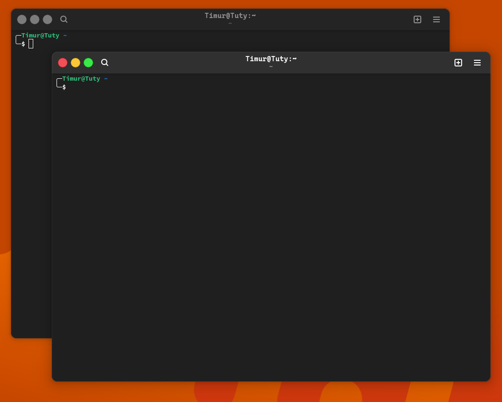
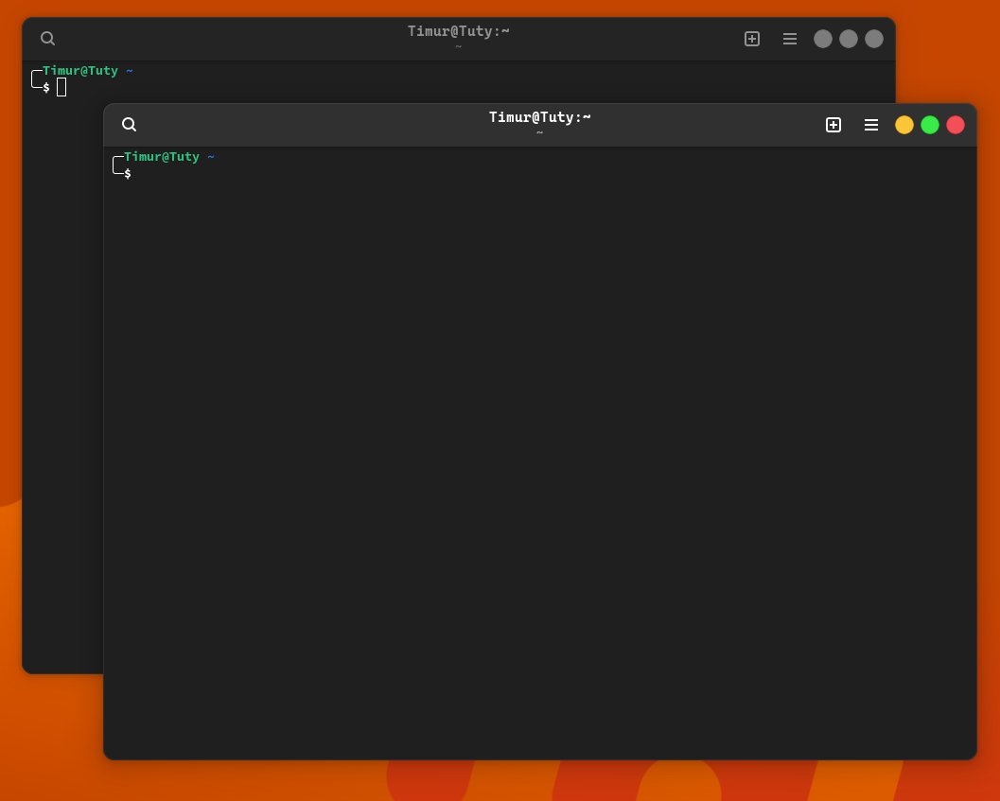

# 🤡macOS-like window controls

These styles convert regular gnome controls to macOS-like ones.
Styles also support gtk-3.0 and gtk-4.0 and can be installed together with other Gnome themes.

You can judge the results of the styles by this screenshots.





## 🌟Overview
Window controls in enlarged view.


Bugs in styles are also possible. For example, in vs-code, the distance between the buttons increases, and etc.


I will work on correcting these errors. Also, you can always help me with this.


## 💡Installation
* Download the **latest zip** archive from the [releases](https://github.com/timurtuty/macos-theme-window-controls/releases).
* Unzip the archive to **~/.config** to get a **macos-like-window-controls** folder with styles.
* Add this line **to ~/.config/gtk-3.0/gtk.css**
```css
@import "../macos-like-window-controls/gtk-3.0.css";
```
* Add this line to **~/.config/gtk-4.0/gtk.css**
```css
@import "../macos-like-window-controls/gtk-4.0.css";
```
* Reboot
```bash
$ reboot
```

## 🏮Tested
* Tested on Gnome 46.0 ArchLinux x86_64 kernel 6.8.7-zen1-1-zen wayland
